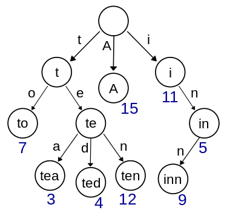

<!--
 * @Author: Nettor
 * @Date: 2020-06-28 21:30:12
 * @LastEditors: Nettor
 * @LastEditTime: 2020-06-29 12:27:50
 * @Description: file content
-->

# Implement Trie (Prefix Tree)

Implement a trie with `insert`, `search`, and `startsWith` methods.

**Example:**

```go
Trie trie = new Trie();

trie.insert("apple");
trie.search("apple");   // returns true
trie.search("app");     // returns false
trie.startsWith("app"); // returns true
trie.insert("app");
trie.search("app");     // returns true
```

**Note:**

- You may assume that all inputs are consist of lowercase letters a-z.
- All inputs are guaranteed to be non-empty strings.

## Solution

前缀树又叫字典树，是一种多叉树结构，下图就是一个例子：



除了叶子节点外，其余每一个节点点都保存一个字母，最后的叶子节点保存单词，因此可以设定一个长度为 26 的数组保存 26 棵根节点为 26 个字母的字典树。查询单词时每一个首字母都能对应一个入口。

其实就跟平时我们查单词差不多，比如要查 Hello，先找到 H 所在的页，再找到 He 所在的页...

懂点机器学习的马上就能明白这也就一堆决策树组成的森林。

比起讲解直接看代码更加清楚。

## Go Solution

```go
type Trie struct {
    children [26]*Trie
    endOfWord bool
}


/** Initialize your data structure here. */
func Constructor() Trie {
    return Trie {}
}


/** Inserts a word into the trie. */
func (this *Trie) Insert(word string)  {
    current := this
    // for range的方式遍历word取得的是rune类型
    for _, ch := range word {
        //防止index超过26
        index := ch - 'a'
        //找不到该字母的节点就新建一个
        if current.children[index] == nil {
            current.children[index] = &Trie {}
        }
        current = current.children[index]
    }
    current.endOfWord = true
}


/** Returns if the word is in the trie. */
func (this *Trie) Search(word string) bool {
    current := this
    for _, ch := range word {
        index := ch - 'a'
        if current.children[index] == nil {
            return false
        }
        current = current.children[index]
    }
    return current.endOfWord
}


/** Returns if there is any word in the trie that starts with the given prefix. */
func (this *Trie) StartsWith(prefix string) bool {
    current := this
    for _, ch := range prefix {
        index := ch - 'a'
        if current.children[index] == nil {
            return false
        }
        current = current.children[index]
    }
    return true
}


/**
 * Your Trie object will be instantiated and called as such:
 * obj := Constructor();
 * obj.Insert(word);
 * param_2 := obj.Search(word);
 * param_3 := obj.StartsWith(prefix);
 */
```
