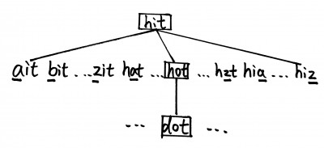

<!--
 * @Author: Nettor
 * @Date: 2020-07-14 14:02:56
 * @LastEditors: Nettor
 * @LastEditTime: 2020-07-14 15:16:01
 * @Description: file content
-->

# Word Ladder

Given two words (beginWord and endWord), and a dictionary's word list, find the length of shortest transformation sequence from beginWord to endWord, such that:

1. Only one letter can be changed at a time.
2. Each transformed word must exist in the word list.

**Note:**

- Return 0 if there is no such transformation sequence.
- All words have the same length.
- All words contain only lowercase alphabetic characters.
- You may assume no duplicates in the word list.
- You may assume beginWord and endWord are non-empty and are not the same.

**Example 1:**

```go
Input:
beginWord = "hit",
endWord = "cog",
wordList = ["hot","dot","dog","lot","log","cog"]

Output: 5

Explanation: As one shortest transformation is "hit" -> "hot" -> "dot" -> "dog" -> "cog",
return its length 5.
```

**Example 2:**

```go
Input:
beginWord = "hit"
endWord = "cog"
wordList = ["hot","dot","dog","lot","log"]

Output: 0

Explanation: The endWord "cog" is not in wordList, therefore no possible transformation.
```

# Solution

每改变一个词的字母，一个 3 位字母的单词，如果仅仅改变其中一位字母，那么有有 26\*3 种组合。

这些组合中只有在 wordList 中的组合才是合法的。

我们要在这这 26\*3 种组合中找到所有符合符合 wordList 的组合，作为一层，而在这一层中的节点，能够通过改变一个字母满足在 wordList 里面的节点作为下一层。

一看就明白这就是 BFS 的思路。



具体步骤：

先把 wordList 转成一个 wordSet

再把 beginWord 打包成{word string,stepNum int}这样一个结构，这里我讨巧只用了 map[string]int 实现，由于每个 map 都只用一个键值对，只需要用 for range 就可以取出 map 的唯一一个 key，也就是 word。

接着出队后的 word 不断变换每一位的字母，比如"num"，从"aum"，"bum"..."zum","nam","nbm"..."nzm"直到"nuz".

每变换一位字母就判断是否存在 wordSet 之中,存在的话就入队，并且 stepNum 加一，再从 wordSet 删除该字。

以**Example 1**举例,每层的节点是这样的：

| stepNum | Node                                             |
| ------- | ------------------------------------------------ |
| 1       | hit                                              |
| 2       | hit->hot,hit->dot                                |
| 3       | dot->dog,hot->lot                                |
| 4       | lot->log,dog->cog (found answer, return stepNum) |

`wordList = ["hot","dot","dog","lot","log","cog"]`

## Go Solution

```go
func ladderLength(beginWord string, endWord string, wordList []string) int {
    // 把wordList转换成一个set
    wordSet := make(map[string]bool)
    for _,word := range wordList{
        wordSet[word] = false
    }

    // 新建队列并且第一个单词入队
    queue := list.New()

    queue.PushBack(map[string]int{beginWord:1})

    // 循环出队
    for queue.Len() != 0{
        top := queue.Front().Value.(map[string]int)
        queue.Remove(queue.Front())
        word := getKey(top)
        fmt.Println(word)

        // 判断是否停止
        if word == endWord{
            return top[word]
        }

        // 转化成rune数组进行遍历
        runeWord := []rune(word)
        for i:=0; i<len(runeWord); i++{
            // 改变节点的每一位的字母
            for c:='a'; c<='z'; c++{
                temp := runeWord[i]
                if runeWord[i]!=rune(c){
                    runeWord[i]=rune(c)
                }
                newWord := string(runeWord)
                // 如果wordSet中存在，那就入队，并从set中删除这个节点
                if _,ok:=wordSet[newWord]; ok == true{
                    queue.PushBack(map[string]int{newWord:top[word]+1})
                    delete(wordSet,newWord)
                }
                runeWord[i]=temp
            }
        }

    }
    return 0
}

func getKey(wordNode map[string]int) string{
    var key string
    for k:= range wordNode{
        key = k
    }
    return key
}
```
